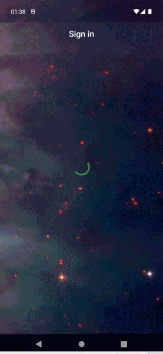
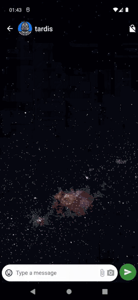
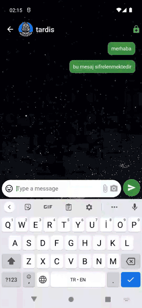
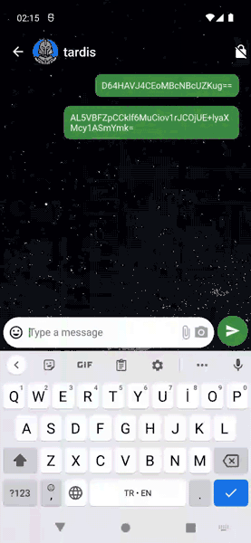

# NewsFeedApp

This Flutter project is an encrypted messaging application that works with Firebase database. Mvvm architecture, Provider and Get-it are used.

<h3 align="left">Screenshots</h3>

 
 
   
  
 
 
   
  
 
 
   
  